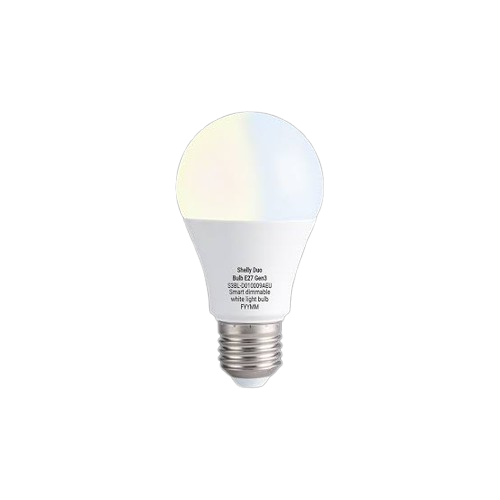

The Shelly Duo Bulb E27 Gen3 (model `S3BL-D010009AEU`) is a dimmable Wi-Fi/Bluetooth LED bulb with tunable white
(warm white and cold white channel) and an E27 socket. It is built around an `ESP-Shelly-C38F` module with an
ESP32-C3 (8 MB flash, 40 MHz crystal).

| Property          | Value                              |
| ----------------- | ---------------------------------- |
| Model             | S3BL-D010009AEU                    |
| SoC               | ESP32-C3                           |
| Flash             | 8 MB                               |
| Supply            | 220–240 V~, 50/60 Hz               |
| Power             | 8.5 W, up to ~800 lm               |
| Color temperature | 2700 K – 6500 K                    |
| Base              | E27, A60 (60 x 110 mm)             |

> **Warning:** The bulb contains a **non-isolated mains power supply**. Never connect a serial adapter while the bulb
> is connected to mains voltage. Flash it only while it is removed from the socket and powered from the 3.3V of the
> adapter.

## GPIO Pinout

| Pin   | Function                                           |
| ----- | -------------------------------------------------- |
| GPIO4 | Warm white (`W`, module pad `MTMS`)                |
| GPIO5 | Cold white (`cout`, module pad `MTDI`)             |
| GPIO9 | BOOT (download mode, low-active)                   |

## Flashing

> **Note:** Flashing is done via UART. The pads are on the edge of the module and have to be soldered
> (hence difficulty 4). OTA from the original Shelly firmware has not been verified.

### Disassembly

Remove the frosted PC cover and the LED board to reach the driver PCB with the module. The module and the
connector pads are covered with some adhesive/sealant that has to be removed carefully.

### Wiring

Connect a **3.3V** USB-to-serial adapter to the UART pads on the module. Pad order (from the PCB downwards):

| Pad | Function |
| --- | -------- |
| 1   | TX       |
| 2   | RX       |
| 3   | 3V3      |
| 4   | RESET    |
| 5   | BOOT     |
| 6   | GND      |

To enter download mode, connect **BOOT** to GND while powering on the module (or while pulsing **RESET** to GND).
Release BOOT after the chip has started.

### Backup the original firmware

Always back up the original firmware before flashing:

```sh
esptool.py --chip esp32c3 --port /dev/ttyUSB0 --baud 460800 \
  --before no-reset --after no-reset \
  read_flash 0 0x800000 shelly-duo-bulb-e27-gen3-backup.bin
```

### Compile

```sh
esphome compile config.yaml
```

The factory binary is located at:

`.esphome/build/shelly-duo-bulb-e27-gen3/.pioenvs/shelly-duo-bulb-e27-gen3/firmware-factory.bin`

### Flash

```sh
esptool.py --chip esp32c3 --port /dev/ttyUSB0 --baud 460800 \
  write_flash 0x0 firmware-factory.bin
```

## Basic Configuration

```yaml file=config.yaml

```

## Additional Notes

- The stock firmware shows power consumption only after the bulb model has been selected in the Shelly app, so the
  value is most likely an estimate derived from the PWM duty cycle. No energy meter chip is known and none is
  part of the configuration.
- Factory reset of the stock firmware: switch the bulb on and off 4 times with 3 seconds in between.
