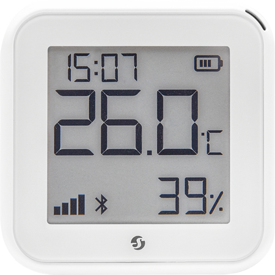

## Shelly H&T Gen3



Battery-powered WiFi temperature/humidity sensor with a segment E-Paper display (UC8119 controller).
Uses an ESP32-C3 with 8MB flash, a Sensirion SHT31 sensor, and a UltraChip UC8119
E-Paper segment display with 91 active segments, 10 digits and 13 icons.

*Requires custom ESPHome external components for the UC8119 display and Shelly H&T display layer.*

## GPIO Pinout

| GPIO | Function | Notes |
|--------|----------------|-----------------------------------------------|
| GPIO0 | Button | XTAL_32K_P, ext. pull-up, deep sleep wakeup |
| GPIO1 | I2C SDA | Shared bus (SHT31 + UC8119), ext. pull-up |
| GPIO2 | Power Rail ADC | Reads regulated 3.3V rail, not battery |
| GPIO3 | I2C SCL | 100kHz, external pull-up on FPC |
| GPIO4 | Battery ADC | Via voltage divider (÷3), GPIO18 enable |
| GPIO5 | Battery Presence | HIGH when batteries are connected |
| GPIO6 | UC8119 BUSY_N | LOW=busy, external pull-up on FPC |
| GPIO7 | UC8119 RESET_N | Active LOW, 10ms pulse |
| GPIO8 | USB Detect | HIGH=USB connected, LOW=battery |
| GPIO10 | UC8119 Enable | Display power gate, HIGH=on |
| GPIO18 | Batt Power En | Enables power-path for battery ADC |

## I2C Devices

| Device | Address | Function |
|--------|---------|--------------------------|
| SHT31 | 0x44 | Temperature & Humidity |
| UC8119 | 0x50 | E-Paper Segment Display |

## Serial Pinout (PCB Test Pads)


The UART pads are bare test points on the PCB (no header installed).
Use pogo pins, test clips, or solder temporary wires for flashing.

| Pad | Function       |
|-----|----------------|
| 1   | NC             |
| 2   | RXD            |
| 3   | CHIP_EN        |
| 4   | GND            |
| 5   | TXD            |
| 6   | VCC 3V3        |
| 7   | BOOT / GPIO9   |

## Flashing

The device can be flashed in two ways:

- **OTA from the Shelly stock firmware** using the [**ShellyOTA**](https://github.com/oxynatOr/free-shelly-ota) script.
- **UART** via the PCB test pads (needed for recovery or if OTA is not possible).

### OTA from Shelly Stock Firmware

Requirements:

- Stock firmware **2.0.1** or **2.0.2** (tested). Other versions are untested.
- Battery level of at least **35 %**, otherwise the update is refused.
- The ESPHome build must use the Shelly **stock partition table**, so the image fits the
  layout on the device. Copy `docu/csv/HTG3-stock.csv` from this repository next to your YAML
  and add the `partitions` and `CONFIG_PARTITION_TABLE_OFFSET` lines shown in the
  configurations below.

Build the firmware with `esphome compile` and upload the resulting OTA binary with
[**ShellyOTA**](https://github.com/oxynatOr/free-shelly-ota).

> **Note:** The partition table of the device stays Shelly's. The CSV only makes ESPHome build
> against the same layout. The table sits at `0xf000` on this device.

After the first ESPHome flash, further updates work through the normal ESPHome OTA.

### Flashing via UART

To enter download mode, short **pad 7 (GPIO9)** to **pad 4 (GND)** while powering on the device. Release after boot.

### Backup the Original Firmware

Always back up the original firmware before flashing:

```bash
esptool.py --chip esp32c3 --port /dev/ttyUSB0 --baud 460800 \
  --before no-reset --after no-reset \
  read_flash 0 0x800000 shelly-ht-gen3-backup.bin
```

### Compile and Flash (UART)

```bash
esphome compile shelly-ht-gen3.yaml
esptool.py --chip esp32c3 --port /dev/ttyUSB0 --baud 460800 \
  write_flash 0x0 .esphome/build/shelly-ht-gen3/.pioenvs/shelly-ht-gen3/firmware-factory.bin
```

## Basic Configuration (USB Powered)
```yaml file=config.yaml
```


## Battery Powered Configuration (Deep Sleep)
```yaml file=deep_sleep.yaml
```


## Display Layout

The UC8119 segment display has the following layout (all segments shown):

```text
+--------------------------------------------+
|                                            |
|  88:88            Arrow  Battery           |
|  T1 T2 : T3 T4     ^    [||||]             |
|                                            |
|  88.8              [8] °                   |
|  D1 D2 . D3       UNIT (C/F)               |
|  Temperature                               |
|                                            |
|  Frost Heat Vent  ?  Calendar              |
|   *     ~    @    =    #                   |
|                                            |
|  Signal  BT  Globe      88 %               |
|  ||||    *    @         H1 H2              |
|                         Humidity           |
|                                            |
+--------------------------------------------+
```

**Zones:**

| Zone | Digits | Function |
|------|--------|----------|
| Top left | T1 T2 : T3 T4 | Clock (HH:MM) |
| Top right | Arrow + Battery | Arrow, 5-segment battery |
| Center left | D1 D2 . D3 | Temperature (XX.X) |
| Center right | UNIT | °C/°F (small digit + °) |
| Icon row 1 | ❄ ♨ ❀ ☰ 📅 | Frost, Heat, Vent, ?, Cal |
| Icon row 2 | Signal, BT, Globe | WiFi, Bluetooth, Globe |
| Bottom right | H1 H2 % | Humidity (XX%) |

## Battery Measurement

The battery voltage is measured via GPIO4 (ADC1) through a voltage
divider (÷3). The measurement circuit requires GPIO18 to be set HIGH
to enable the power path before reading. The component handles this
automatically via the `battery_power_enable` output.

- **4× AA (LR6):** 4.0V (empty) to 6.4V (fresh)
- **ADC range:** ~1.33V to ~2.13V after divider
- **GPIO5:** Battery presence (HIGH when connected)
- **GPIO8:** USB detection (HIGH when USB connected)

## Deep Sleep Behavior

The component auto-detects deep sleep mode from the YAML config:

- **WiFi wake** (every Nth cycle): Full boot, HA time sync (~5s)
- **Non-WiFi wake** (other cycles): No WiFi, RTC time, fast (~1.5s)
- **USB connected:** Deep sleep prevented, always-on mode
- **Button press (GPIO0):** Wakes device from deep sleep

The `on_ready` trigger fires after non-WiFi display updates, allowing
the YAML to control when to enter deep sleep. The `on_shutdown` handler
saves the framebuffer to RTC memory, enabling partial refresh on the
next wake (no white flash).

## Known Limitations

- **OTA from Shelly firmware needs ShellyOTA:** Only tested with stock firmware 2.0.1 and 2.0.2,
  and the battery must be at least 35 %. UART flashing remains available as a fallback.
- **Battery percentage accuracy:** The voltage-to-percentage mapping
  may need calibration for your battery chemistry and temperature.
  Default range (4.0V–6.0V) is for 4× AA alkaline batteries.
