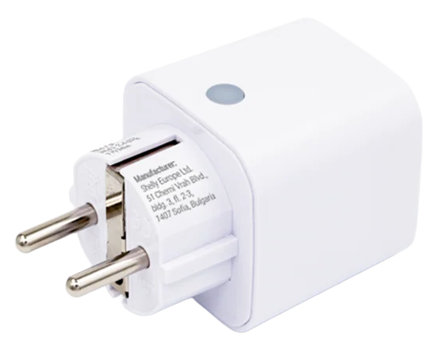
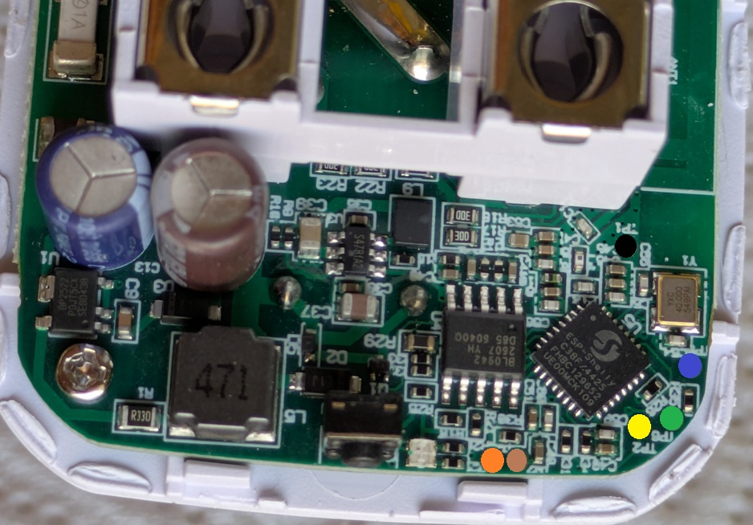

Generation 3 of Shelly Plug M (ESP32-C3, BL0942 power meter, relay with zero-cross detection, NTC temperature sensor,
RGB status LED).



## Flashing

There are two ways to get ESPHome onto the plug.

### Option 1: OTA from the stock firmware (Free-Shelly-OTA)

The plug does not have to be opened. Build the ESPHome firmware with the [basic configuration](#configuration) plus
the [OTA stock layout settings](#optional-ota-from-the-stock-firmware) and upload the resulting image using
[**Free-Shelly-OTA**](https://github.com/oxynatOr/free-shelly-ota).

### Option 2: UART

Open the plug and connect a USB-UART adapter.



| Pin     | Colour |
| ------- | ------ |
| 3v3     | Orange |
| Reset   | Brown  |
| BootSEL | Yellow |
| RX      | Blue   |
| TX      | Green  |
| GND     | Black  |

As always, first take a dump!

`esptool -b 115200 --port COM11 read_flash 0x00000 0x800000 shelly_plug_m_gen3.bin`

## GPIO Pinout

| Pin    | Function                         |
| ------ | -------------------------------- |
| GPIO0  | Relay                            |
| GPIO1  | NTC temperature (ADC)            |
| GPIO3  | Zero-cross detection (BL0942 ZX) |
| GPIO4  | BL0942 TX                        |
| GPIO5  | BL0942 RX                        |
| GPIO7  | Button                           |
| GPIO10 | LED green                        |
| GPIO18 | LED red                          |
| GPIO19 | LED blue                         |

## Configuration

The basic configuration is meant for a UART flash; for OTA from the stock firmware add the optional settings below. It
uses a plain `gpio` relay switch. The `*_reference` values are calibration values of the BL0942 and differ from device
to device, so calibrate your own plug.

```yaml file=config.yaml
```

## Optional: OTA from the stock firmware

A firmware that is flashed over the air from the stock Shelly firmware has to follow the stock flash layout.
Otherwise the image installs, but the plug does not boot afterwards. The additional config below adds these settings:

| Setting | Why |
| ------- | --- |
| `flash_size: 8MB` | The plug has 8 MB of flash. |
| `partitions: PlugMG3-stock.csv` | Shelly's own partition layout, placed next to your YAML file. |
| `CONFIG_PARTITION_TABLE_OFFSET: "0x10000"` | The stock firmware keeps the partition table at `0x10000`, not at the ESP-IDF default `0x8000`. Without this the firmware cannot find its partitions at boot. |
| `ota: platform: esphome` with `allow_partition_access: true` | Allows the OTA component to write to the partitions of the stock layout. |

```yaml file=ota-stock-layout.yaml
```

Add it to your own configuration with [packages](https://esphome.io/components/packages/):

```yaml inline
packages:
  ota_stock: !include ota-stock-layout.yaml
```

Build the firmware and upload the image using [**Free-Shelly-OTA**](https://github.com/oxynatOr/free-shelly-ota). Once
ESPHome is running, further updates work as usual via ESPHome OTA. Keep the settings above in every later build,
otherwise the next OTA update can leave the plug unbootable (then UART is the only way back).

## Optional: zero-cross switching

The stock Shelly firmware moves the relay contacts at a zero crossing of the mains voltage, which reduces arcing and
contact wear. The custom component
[`zero_cross_switch`](https://github.com/oxynatOr/esphome-zero_cross_switch) does the same in ESPHome. It follows the
zero-cross signal, measures the mains frequency and delays each switch so the contacts move at the following zero
crossing, using the relay times of the stock firmware (6500 µs on, 7800 µs off).

On the Plug M Gen3 the zero-cross signal is on GPIO3, the multiplexed CF/ZX pin of the BL0942. After a reset this pin
outputs the energy pulses. With `chip_type: bl0942` the component writes the BL0942 register `OT_FUNX = 2` over the
UART shortly after boot (and repeats it if the signal disappears), after which the pin flips at every zero crossing.
That is why the switch needs the `uart_id` of the BL0942 and `zx_edge: ANY`. The optional `frequency` sensor reports
the measured mains frequency.

If there is no clean zero-cross signal, the relay switches immediately, like a plain `gpio` switch. The log tells
you when that happens.

Tested on the Plug M Gen3 (50 Hz): the component locks on the signal, and the delays it applies match the expected
3500 µs (on) and 2200 µs (off). The component is experimental. The relay times are the numbers of the stock firmware
and were not measured, and the contact timing itself can only be confirmed with an oscilloscope. Do not rely on it for
anything critical. The BL0942 energy pulse output (CF) is not available while the zero-cross output is active; the
power measurement over the UART is not affected.

The component replaces the plain `gpio` relay of `config.yaml`: remove the `switch:` entry with `id: relay` there, or
use `zero-cross.yaml` in its place. The add-ons that extend `relay` keep working, because the id stays the same.

```yaml file=zero-cross.yaml
```

## Optional add-ons

All add-ons below extend the entities of `config.yaml` (via `!extend`), so use them together with `config.yaml`, for
example as [packages](https://esphome.io/components/packages/). Take only the ones you need:

```yaml inline
packages:
  base: !include config.yaml
  protection: !include plug-protection.yaml
  led: !include plug-led.yaml
  energy: !include plug-energy.yaml
  calibration: !include plug-calibration.yaml
```

| File | Needs | What it does |
| ---- | ----- | ------------ |
| `ota-stock-layout.yaml` | `PlugMG3-stock.csv` | OTA from the stock firmware, see above |
| `zero-cross.yaml` | the custom component | Zero-cross switching, see above |
| `plug-protection.yaml` | `api` | Over-current / over-power / over-temperature protection, NTC watchdog, staggered restart |
| `plug-led.yaml` | `plug-protection.yaml` | Status LED with the effects Live Current / Power / Temperature |
| `plug-gestures.yaml` | `plug-protection.yaml`, `plug-led.yaml` | Button gestures and child lock |
| `plug-energy.yaml` | a `time:` platform | Energy Today / Energy Total sensors |
| `plug-calibration.yaml` | `api` | BL0942 calibration at runtime, without reflashing |

The button (GPIO7) is defined in `config.yaml`: a single short press toggles the relay (with a delay of about 0.35 s,
because the button waits for a possible second click). The `config.yaml` must contain the entity ids that the add-ons
extend (`ntc_temp`, `rgb_lights`, `bcurrent`, `bpower`, ...); they are already set there.

### Protection

Latched protection against over-current, over-power and over-temperature (switch **Fault Lock**, notification in Home
Assistant), a temperature sensor watchdog (binary sensor **Temperature Sensor Fault**) and a staggered relay restart
after a power loss. Clear a fault by holding the button for 2.5 s (only once the plug has cooled down) or by switching
**Fault Lock** off. The limits (`max_current`, `max_power`, `max_temp`, ...) are substitutions at the top of the file;
adjust them to your plug.

```yaml file=plug-protection.yaml
```

### Status LED

The single RGB LED shows the status. Pick the effect **Live Current**, **Live Power** or **Live Temperature** in Home
Assistant. Red breathing = fault, magenta = temperature sensor fault, amber blink = close to a limit, red pulse = no
Wi-Fi, amber pulse = no API client, blue blink = OTA update. If you also use the OTA settings above, both files share
the entry `id: ota_esphome`, so they merge. If you have your own `ota:` entry with platform esphome, give it that id.

```yaml file=plug-led.yaml
```

### Button gestures and child lock

| Gesture | Action |
| ------- | ------ |
| 1x click | Toggle the relay (blocked while the child lock is on) |
| 2x click | Next LED effect (Current, Power, Temperature) |
| 3x click | Child lock on (switch **Button Lock**, kept over a power loss) |
| 3x click, hold the last press for 1.5 s | Child lock off |
| Hold for 2.5 s | Acknowledge a fault (see Protection), otherwise LED on/off |

The LED gives feedback: orange blink = pressed while locked, fast red blink = pressed while a fault is latched,
orange fade-in = child lock on, green fade-out = child lock off. While the child lock is on, the LED flashes orange
briefly every 3 s. The child lock only blocks the button, not Home Assistant.

```yaml file=plug-gestures.yaml
```

### Energy

```yaml file=plug-energy.yaml
```

### Calibration

The `*_reference` values of the BL0942 are plain divisors, so they can be changed at runtime. Enter the value of a
reference meter in **Cal Target Voltage/Current/Power** and press **Calibrate Voltage/Current/Power**. The new
reference is stored in flash; **Reset Calibration** returns to the values from the YAML. The calibration can also
be started from Home Assistant with the action `esphome.<device>_calibrate`.

```yaml file=plug-calibration.yaml
```
