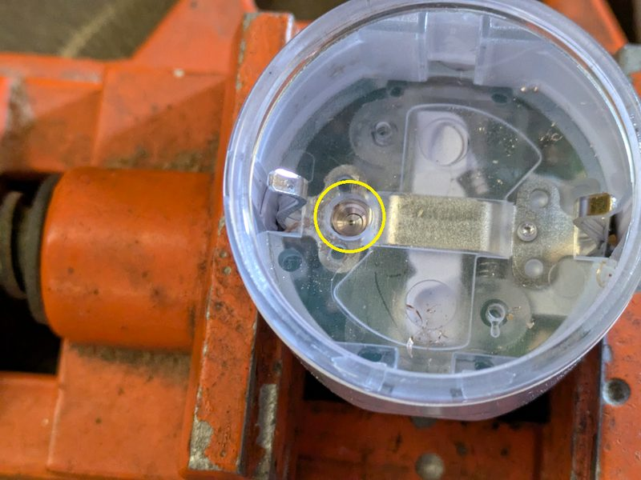
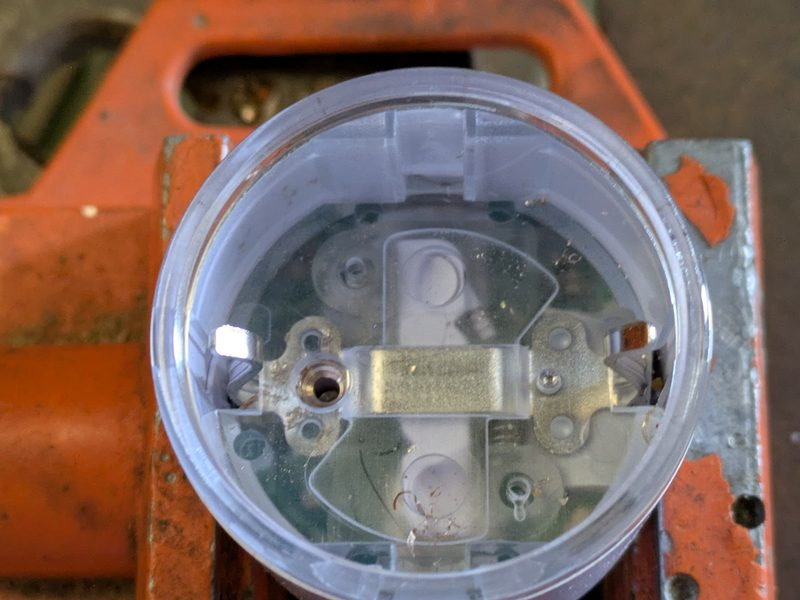
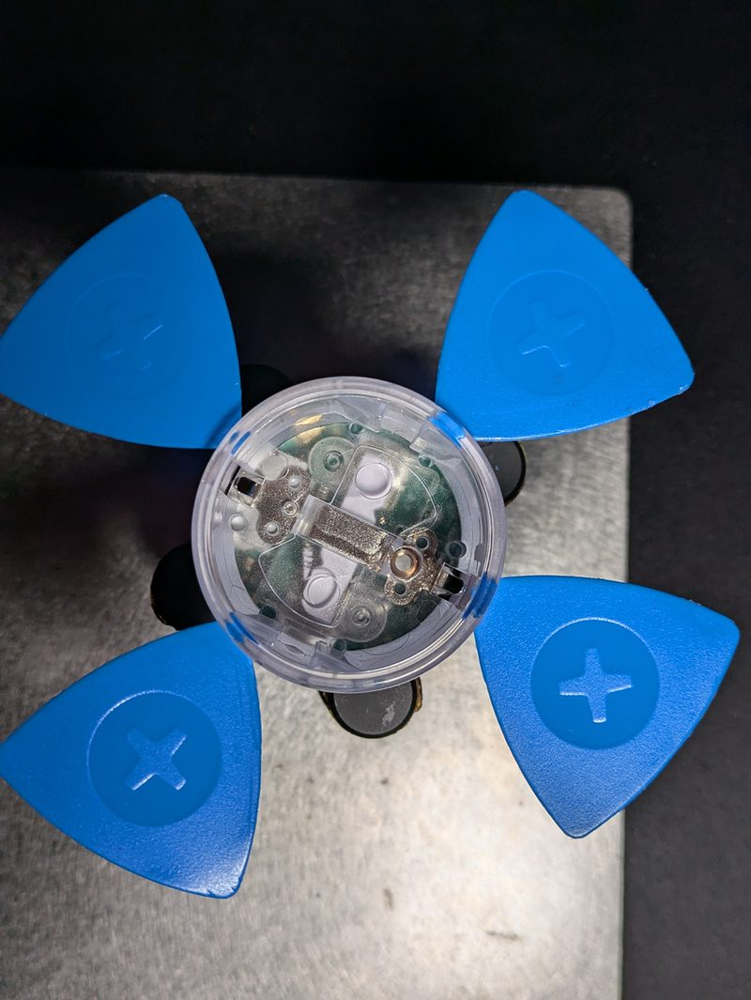
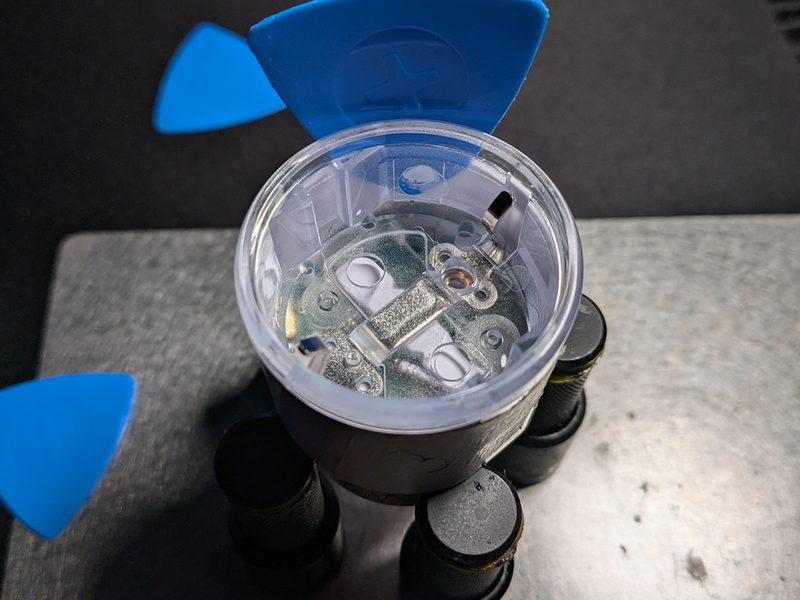

Generation 3 of the [Shelly Plug S](https://www.shelly.com/products/shelly-plug-s-gen3) (ESP32-C3, BL0942 power
meter, relay, NTC temperature sensor, 4 WS2812 status LEDs, button).

## Flashing

There are two ways to get ESPHome onto the plug.

### Option 1: OTA from the stock firmware (Free-Shelly-OTA)

The plug does not have to be opened. Build the ESPHome firmware with the [basic configuration](#configuration) plus
the [OTA stock layout settings](#optional-ota-from-the-stock-firmware) and upload the resulting image using
[**Free-Shelly-OTA**](https://github.com/oxynatOr/free-shelly-ota).

### Option 2: UART

Open the plug (see [Open the device](#open-the-device)) and connect a USB-UART adapter. As always, first take a dump!

`esptool -b 115200 --port COM11 read_flash 0x00000 0x800000 shelly_plug_s_gen3.bin`

#### UART Pinout

| Pin     | Colour |
| ------- | ------ |
| Reset   | Brown  |
| 3v3     | Red    |
| RX      | Blue   |
| TX      | Yellow |
| BootSEL | Purple |
| GND     | Black  |


## GPIO Pinout

| Pin    | Function             |
| ------ | -------------------- |
| GPIO3  | Internal Temperature |
| GPIO4  | Relay                |
| GPIO5  | LED WS2812           |
| GPIO6  | BL0942 RX            |
| GPIO7  | BL0942 TX            |
| GPIO18 | Button               |

## Configuration

The basic configuration uses a plain `gpio` relay switch. A single short press of the button toggles the relay (with a
delay of about 0.35 s, because the button waits for a possible second click). The `*_reference` values of the BL0942
are the ESPHome defaults; see the calibration add-on below to adjust them.

```yaml file=config.yaml
```

## Optional: OTA from the stock firmware

A firmware that is flashed over the air from the stock Shelly firmware has to follow the stock flash layout.
Otherwise the image installs, but the plug does not boot afterwards. The additional config below adds these settings:

| Setting | Why |
| ------- | --- |
| `flash_size: 8MB` | The plug has 8 MB of flash. |
| `partitions: PlugSG3-stock.csv` | Shelly's own partition layout, placed next to your YAML file. |
| `CONFIG_PARTITION_TABLE_OFFSET: "0x10000"` | The stock firmware keeps the partition table at `0x10000`, not at the ESP-IDF default `0x8000`. Without this the firmware cannot find its partitions at boot. |
| `ota: platform: esphome` with `allow_partition_access: true` | Allows the OTA component to write to the partitions of the stock layout. |

```yaml file=ota-stock-layout.yaml
```

Add it to your own configuration with [packages](https://esphome.io/components/packages/):

```yaml inline
packages:
  ota_stock: !include ota-stock-layout.yaml
```

Build the firmware and upload the image using [**Free-Shelly-OTA**](https://github.com/oxynatOr/free-shelly-ota).
Once ESPHome is running, further updates work as usual via ESPHome OTA. Keep the settings above in every later build,
otherwise the next OTA update can leave the plug unbootable (then UART is the only way back).

## Optional add-ons

All add-ons below extend the entities of `config.yaml` (via `!extend`), so use them together with `config.yaml`, for
example as [packages](https://esphome.io/components/packages/). Take only the ones you need:

```yaml inline
packages:
  base: !include config.yaml
  protection: !include plug-protection.yaml
  led: !include plug-led.yaml
  gestures: !include plug-gestures.yaml
```

| File | Needs | What it does |
| ---- | ----- | ------------ |
| `ota-stock-layout.yaml` | `PlugSG3-stock.csv` | OTA from the stock firmware, see above |
| `plug-protection.yaml` | `api` | Over-current / over-power / over-temperature protection, NTC watchdog, staggered restart |
| `plug-led.yaml` | `plug-protection.yaml` | Status LEDs with the effects Live Current / Power / Temperature |
| `plug-gestures.yaml` | `plug-protection.yaml`, `plug-led.yaml` | Button gestures and child lock |
| `plug-energy.yaml` | a `time:` platform | Energy Today / Energy Total sensors |
| `plug-calibration.yaml` | `api` | BL0942 calibration at runtime, without reflashing |
| `plug-night.yaml` | `plug-led.yaml` | Night mode: dims the LEDs, manually or on a schedule |
| `plug-autooff.yaml` | `api` | Auto-off timer and standby killer |
| `plug-failsafe.yaml` | `plug-protection.yaml` | Behaviour when Home Assistant is gone |
| `plug-diagnostics.yaml` | `plug-protection.yaml` | Last fault, fault count, relay cycles |

The `config.yaml` must contain the entity ids that the add-ons extend (`ntc_temp`, `rgb_lights`, `bcurrent`,
`bpower`, ...); they are already set there.

### Protection

Latched protection against over-current, over-power and over-temperature (switch **Fault Lock**, notification in
Home Assistant), a temperature sensor watchdog (binary sensor **Temperature Sensor Fault**) and a staggered relay
restart after a power loss. Clear a fault by holding the button for 2.5 s (only once the plug has cooled down) or by
switching **Fault Lock** off. The limits (`max_current`, `max_power`, `max_temp`, ...) are substitutions at the top of
the file; adjust them to your plug.

```yaml file=plug-protection.yaml
```

### Status LEDs

The four LEDs show the status. Pick the effect **Live Current**, **Live Power** or **Live Temperature** in Home
Assistant. Current and power are shown as a bar from green to red (power on a logarithmic scale), the temperature as a
colour from blue to red. Red breathing = fault, magenta blink = temperature sensor fault, amber blink = close to a
limit, red pulse on the first LED = no Wi-Fi, amber pulse = no API client, blue runner = OTA update.

If you also use the OTA settings above, both files share the entry `id: ota_esphome`, so they merge. If you have your
own `ota:` entry with platform esphome, give it that id.

```yaml file=plug-led.yaml
```

### Button gestures and child lock

| Gesture | Action |
| ------- | ------ |
| 1x click | Toggle the relay (blocked while the child lock is on) |
| 2x click | Next LED effect (Current, Power, Temperature) |
| 3x click | Child lock on (switch **Button Lock**, kept over a power loss) |
| 3x click, hold the last press for 1.5 s | Child lock off |
| Hold for 2.5 s | Acknowledge a fault (see Protection), otherwise LEDs on/off |

The LEDs give feedback: orange blink = pressed while locked, fast red blink = pressed while a fault is latched,
orange fill-up = child lock on, green fade-out = child lock off. While the child lock is on, the last LED breathes
orange. The child lock only blocks the button, not Home Assistant.

```yaml file=plug-gestures.yaml
```

### Energy

```yaml file=plug-energy.yaml
```

### Calibration

The `*_reference` values of the BL0942 are plain divisors, so they can be changed at runtime. Enter the value of a
reference meter in **Cal Target Voltage/Current/Power** and press **Calibrate Voltage/Current/Power**. The new
reference is stored in flash; **Reset Calibration** returns to the values from the YAML. The calibration can also
be started from Home Assistant with the action `esphome.<device>_calibrate`.

```yaml file=plug-calibration.yaml
```

### Night mode

Dims the LED effects. Faults, feedback and warnings are never dimmed. **Night Mode** is a manual switch, **Night Mode
Auto** follows a schedule (`night_start` and `night_end`, default 22 to 6 o'clock) and needs a `time:` platform.

```yaml file=plug-night.yaml
```

### Auto-off timer and standby killer

Both are off by default and only ever switch the relay off. Do not use the standby killer on compressor loads
(freezer, fridge): their power is about 0 W while the compressor rests, and the plug would cut them off.

```yaml file=plug-autooff.yaml
```

### Failsafe

What the plug does when Home Assistant is gone: keep the relay as it is (default), switch it on or switch it off.
This add-on also disables the ESPHome reboot timeouts, so a network outage does not restart the plug.

```yaml file=plug-failsafe.yaml
```

### Diagnostics

Last fault with time, fault count and relay cycles. Needs a `time:` platform for the timestamp.

```yaml file=plug-diagnostics.yaml
```

## Open the device

.jpeg> "Seal [thx to bkbartk]")

This little seal has to be drilled open. It is best to use a center punch and an M3.5-M4 drill bit.



Once the seal is cracked open, take an M2 drill bit and drill a little into the center.



Now take a tapered punch and press the seal out. The whole grounding receptacle will come out.

You need a hot-air gun (~300 °C) and five iFixit opening picks (the plastic triangles). There are three spots with
glue. Heat them up and try to slide the picks in around the housing.



This creates a small gap. Take another pick, slide it between the white and the transparent plastic, and work your
way around in a circle.



After two rounds you can easily take the device out of its housing.
